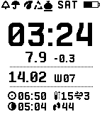

# Rat Scout — Dexcom CGM Watchface for Pebble

A feature-rich Pebble watchface that displays Dexcom continuous glucose monitoring (CGM) data alongside weather, astronomy, and daily life information.

## Overview

Rat Scout connects to the Dexcom Share API to display real-time blood glucose readings on your Pebble smartwatch. In addition to glucose tracking, it shows current time, date, week number, weather conditions (temperature, wind speed, umbrella indicator), sunrise/sunset and moonrise/moonset times, moon phase, step count, garbage collection schedule, and battery status — all on a single watchface.

## Features

### Glucose Monitoring
- **Real-time glucose display** with automatic 5-minute update cycle
- **Glucose delta**: rate of change (±) from previous reading
- **Time since reading**: minutes elapsed since last CGM data
- **Configurable units**: mg/dL or mmol/L
- **Threshold vibration alerts**: distinct vibration patterns for high and low BG
  - High: short-long pattern
  - Low: long-short pattern
  - One-shot: vibrates only on zone transition, not repeatedly
- **Multi-region Dexcom**: US, Outside-US (OUS), and Japan servers

### Weather (OpenWeatherMap)
- **Temperature & wind speed** in metric or imperial units
- **Umbrella indicator**: highlights when rain/snow is expected today (current conditions + 5-day forecast)
- **Smart caching**: configurable interval (30 min – 3 hours) with location-aware cache invalidation (>5 km change)

### Astronomy (ipgeolocation.io)
- **Sunrise/Sunset**: shows the next upcoming event; after sunset shows tomorrow's sunrise
- **Moonrise/Moonset**: handles both normal and inverted moon event ordering
- **Moon phase icon**: 8 phases (new → waxing crescent → … → waning crescent)
- **Daily cache**: fetched once per day, refreshes at midnight

### Time & Date
- **Time**: 12/24-hour format (follows system setting)
- **Date**: day.month format
- **Week number**: ISO week with "W" prefix
- **Weekday**: 3-letter abbreviation in status bar

### Status Bar
- **Hourly vibration indicator**: shows when hourly chime is enabled
- **Umbrella indicator**: highlights when rain is expected
- **Garbage collection**: underscores the next bag type (Organic / Grey / Black) based on weekly schedule, rolls over at 9 AM

### Other
- **Battery indicator**: visual bar with charging animation
- **Step count**: daily steps from Pebble Health (on supported platforms)
- **Persistent state**: data persists across app restarts
- **Cross-platform**: Aplite, Basalt, Chalk, Diorite, Emery

## Requirements

- **Pebble smartwatch** (any platform)
- **Dexcom Share account** with a connected CGM transmitter
- **Pebble/Rebble app** on your phone
- **Internet connection** on phone for API access

## Configuration

Open Rat Scout settings from the Pebble/Rebble app on your phone.

### Dexcom Account
| Setting | Description |
|---------|-------------|
| Login | Dexcom Share account email/username |
| Password | Dexcom Share account password |

### Display
| Setting | Description |
|---------|-------------|
| BG Units | mg/dL or mmol/L |
| Show BG Delta | Toggle glucose rate of change |
| Show Time Delta | Toggle time since last reading |

### Notifications
| Setting | Description |
|---------|-------------|
| Hourly Vibration | Double-pulse every hour on the hour |
| BG Threshold Vibration | Enable/disable glucose threshold alerts |
| Low BG Threshold | Alert threshold in your preferred units |
| High BG Threshold | Alert threshold in your preferred units |

### Astronomy (Optional)
| Setting | Description |
|---------|-------------|
| API Key | ipgeolocation.io API key ([free signup](https://ipgeolocation.io/)) |

### Weather (Optional)
| Setting | Description |
|---------|-------------|
| API Key | OpenWeatherMap API key ([free signup](https://openweathermap.org/api)) |
| Units | Metric (°C, m/s) or Imperial (°F, mph) |
| Update Interval | 30 min, 1 hour, 2 hours, or 3 hours |

All settings are stored locally on your phone.

## Architecture

```
src/
├── c/
│   └── rat_scout.c          # Watchface UI, rendering, vibration alerts, persistent storage
└── pkjs/
    ├── index.js              # App orchestrator: settings, data fetching, message queue
    ├── dexcom.js             # Dexcom Share API client (auth + glucose readings)
    ├── weather.js            # OpenWeatherMap 2.5 API (current + forecast)
    ├── geolocation.js        # ipgeolocation.io astronomy API client
    ├── astronomy.js          # Astronomy time calculations (next sun/moon event logic)
    └── config.json           # Clay settings UI definition
```

### Data Flow

```
Phone JS ─→ Dexcom Share API ─→ Parse glucose + calculate delta ─┐
         ─→ ipgeolocation.io ─→ Astronomy data (cached daily)   ─┤
         ─→ OpenWeatherMap   ─→ Weather data (cached per interval)─┤
                                                                   ├─→ Message Queue ─→ Pebble Watch
                                                Settings ──────────┘
```

Glucose + astronomy data are sent as a single message. Weather data is sent as a separate message. A message queue ensures only one `sendAppMessage` call is in flight at a time.

### Watchface Layout



## Building

Requires Pebble SDK 3.

```bash
pebble build
pebble install --phone <phone_ip>
```

## Credits

- Dexcom API approach inspired by [pydexcom](https://github.com/gagebenne/pydexcom)
- Settings UI powered by [Pebble Clay](https://github.com/pebble/clay)
- Astronomy data by [ipgeolocation.io](https://ipgeolocation.io/)
- Weather data by [OpenWeatherMap](https://openweathermap.org/)

## Disclaimer

This is an unofficial, community-maintained project not affiliated with or endorsed by Dexcom, Inc. Always verify glucose readings with an official Dexcom receiver or app before making medical decisions. This watchface is a convenience tool only.